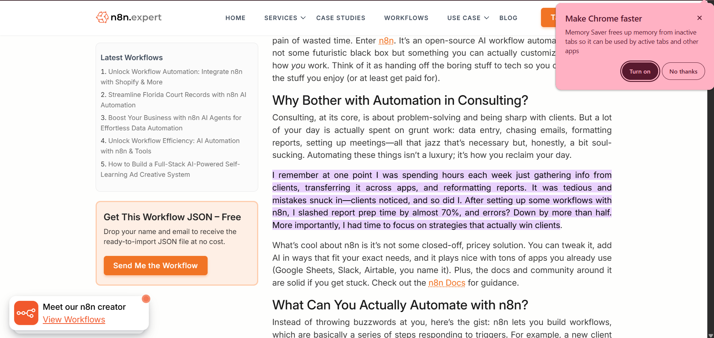

# Roadmap for Aaytham Consulting: Leveraging AI & Automation

Given AyC’s development over the past two years, alongside deep understanding of AI, data, and automation,AyC can gain a competitive edge over other consulting firms by embedding cutting-edge automation and AI tools (e.g. n8n, OpenClaw, GPT-4, etc.) into both its operations and service offerings.

The following three strategic moves outline how AyC can streamline internal workflows and expand client services (in Business Consulting, Branding & Growth, and Social Impact) while also boosting the firm’s tech-forward brand. Each move includes quantified impact estimates and even examples of how PlanPol can apply the same technologies to campaign workflows.

- Internal Efficiency: Automate routine tasks (lead capture, onboarding, reporting, content publishing) to free up consultants’ time.

- New AI Services: Launch AI-powered consulting offerings (data analytics, generative marketing, impact measurement).

- AI-Driven Marketing: Use AI to supercharge AyC’s own marketing and social media presence, projecting an image of innovation and enthusiamsm.

The table below summarizes typical impact metrics when adopting automation and AI (synthesized from industry benchmarks and case studies). cite : https://n8n.expert/workflows/ai-integration-consulting-small-firms/ , https://marketingltb.com/blog/statistics/marketing-automation-statistics/ .

| Metric | Estimated Changes |
|---------|---------------|
| Report preparation time | 70% (saves hours per report) |
| Data-entry errors | –50% (fewer mistakes) |
| Staff hours on admin | –30% (fewer manual tasks) |
| Sales productivity | +12–15% (automation uplift) |
| Leads captured | +50–80% (more leads through automated capture) |
| Conversion rate | +20–30% (better follow-up, personalization) |
| Marketing overhead | –10–15% (less manual work) | 

Summary from the Sources: Automation providers and analysts report ~80% of firms see more leads and higher conversions with marketing automation, and consulting teams have cut reporting time by ~70% using n8n.

### 1. Automate Core Operations with n8n and OpenClaw
Adopting a workflow-automation platform (like n8n, an open-source low-code tool) and AI agents (like OpenClaw, a continuously-running local AI assistant) to eliminate repetitive work. For example, n8n can link AyC’s web forms, email, CRM, and calendar so that when a new lead submits a form, the system automatically:
- Extracts lead data (name, email, company) via AI or scripts.
- Enriches it (e.g. Clearbit/Apollo APIs for firmographics).
- Creates the record in AyC’s CRM or email list.
- Sends a personalized welcome email (GPT-generated content).
- Schedules follow-ups or meetings (syncs with Google Calendar).

Meanwhile, OpenClaw could run as a “virtual assistant” that listens to chat or voice instructions (e.g. “scan new leads in CRM and notify me of high-priority ones”) and proactively handles tasks. Unlike a static bot, OpenClaw “runs continuously…tracking tasks, monitoring conditions, and following up on work” autonomously. For instance, OpenClaw could automatically generate a draft client report at day’s end by pulling data from Airtable and summarizing it with GPT, or ping the consultant's whatsapp if a proposal deadline is missed.

Applying this, AyC’s monthly qualified leads could roughly double, and conversion (proposal-to-client) could improve by 20–30%. A sample estimate table:

| **Area**          | **Before**      | **After Automation**          |
| ----------------- | --------------- | ----------------------------- |
| Lead capture rate | 100 leads/month | 150–180 leads/month (+50–80%) |
| Proposal win rate | 20%             | 24–26% (+20–30%)              |
| Report prep time  | 10 hours/report | ~3 hours (–70%)               |
| Data-entry errors | 10 errors/week  | ~5 errors/week (–50%)         |

PlanPol synergy: The same tools can turbocharge political consulting. n8n workflows could aggregate voter data (e.g. scrape public registries or social media, then normalize it), tag and segment voters, and trigger targeted email/SMS campaigns. OpenClaw could draft and send custom outreach (e.g. “Draft an email to supporters in District 9 about candidate’s education plan”). AI-powered segmentation and messaging align with industry trends: modern campaigns use “AI-powered intelligence [to] identify, analyze, target, and communicate with voters individually and at scale”. By repurposing AyC’s lead-gen system, PlanPol can segment voters (akin to “leads”) and automate personalized persuasion (like sending pro-candidate content to persuadable segments).

We can even use n8n to automate phone calls like https://youtube.com/shorts/g6lFl6pkOxo?si=B9FStj5hF1jApxXc but with better models and lower latency.

### 2: Launch AI-Driven Consulting Services

AyC can expand its service portfolio by packaging AI and automation expertise as client offerings. Examples include:

- AI-Enhanced Business Consulting: Use machine learning to analyze client data and market trends. AyC could offer predictive forecasting (sales or demand) using tools like Python’s scikit-learn or GPT-driven trend analysis, or automated competitive intelligence (bots that scrape news and summarize competitor moves). For instance, an AyC team could build a custom n8n pipeline that gathers public financial data and feeds it into a GPT agent to produce a strategic market report.

- Data-Driven Social Impact: Develop tools to measure and amplify social impact. AyC could create automated dashboards (n8n pulling data from charities, governments, social media) and use AI to analyze sentiment or impact KPIs. It might build recommender systems connecting donors with causes. For instance, an OpenClaw “social-impact analysis” skill could scour news and NGO reports to identify emerging social issues for clients to address. This appeals to impact-focused clients by quantifying outcomes faster and more accurately than manual methods.

Impact: If AyC allocates, say, 20–30% of its practice to AI solutions, we conservatively project a 10–20% uplift in consulting revenue from new clients and higher-value projects. For example, an AI-driven sales enablement service (inspired by OpenAI’s own experience) could enable AyC to command premium fees. In OpenAI’s case, an “AI sales assistant” turned inbound leads into “multimillions in annual recurring revenue”

Similaryly PlanPol can make advanced campaign tools as a service. Examples include automated voter segmentation (clustering supporters by behavior), AI-crafted issue messaging (GPT drafts localized flyers), or an influencer coordination dashboard (n8n tracking social media and alerting when key figures mention relevant topics). These services not only diversify AyC’s business but also make its political arm more effective.

A summary table of potential offerings vs. impact:

| **New AI Service**                | **Value Proposition**                             | **Potential Impact**                                   |
| --------------------------------- | ------------------------------------------------- | ------------------------------------------------------ |
| Predictive Market Analysis        | ML-driven forecasts (e.g. sales, trends)          | Faster insights; ~20% improvement in decision accuracy |
| Automated Branding Content        | GPT/DALL·E social posts, ads, visuals             | 2× social engagement; faster content pipeline          |
| Impact Measurement Platform       | AI dashboards for CSR metrics                     | 50% faster reporting; data-driven strategies           |
| Campaign Targeting Tool (PlanPol) | Voter segmentation + AI messaging personalization | +30% voter outreach efficiency                         |

By formally marketing these AI services, AyC can differentiate itself and justify premium pricing. (Notably, about 76% of firms report positive ROI from marketing automation within 1 year, so clients are likely to pay for proven ROI tools.) cite : https://marketingltb.com/blog/statistics/marketing-automation-statistics

### 3: Build a Tech-Forward Brand and Marketing Machine

AyC could lead the market and apply these tools to its own branding and lead generation, thereby generating social proof. Tactics include:
- Content Marketing with AI: Use n8n to auto-generate blogs, social posts, newsletters. For example, AyC might use OpenAI’s API to draft thought-leadership articles on AI in consulting, then schedule them via n8n to all social channels. AI image tools (DALL·E, Midjourney) can create unique avatars for posts and accounts, signaling innovation. Sharing behind-the-scenes workflows (e.g. a screenshot of an n8n workflow or a timelapse of OpenClaw in action) provides credibility: “We leverage [the newly launched AI agent that’s already 60k-stars strong] to power your projects.” reference : https://www.youtube.com/watch?v=AYsg5gAMWyo

Impact: These efforts can significantly boost AyC’s visibility. Industry data suggest automation frees marketers to do 50% more work, so AyC could reasonably double its content output and therefore its reach. Quantitatively, we might project 50–100% increase in social media followers/mentions and website traffic within a year of active AI-driven marketing. As an example metric table:
| **Social Metric**       | **Baseline** | **With AI-driven Campaign** |
| ----------------------- | ------------ | --------------------------- |
| Monthly blog posts      | 4            | 10 (GPT-scaled)             |
| Social media followers  | 5,000        | ~8,000–10,000 (+60%)        |
| Engagement rate         | 2%           | 4% (+100%)                  |
| Qualified inbound leads | 10/month     | 20–30/month                 |

(Estimates are illustrative; actual results depend on execution. Many marketers report ~12% increase in productivity and up to ~50% more qualified leads after automation.)

PlanPol angle: PlanPol can similarly leverage this branding: automating political content (e.g. scheduling pro-campaign social ads or email blasts) and demonstrating tech-savvy can differentiate candidates. If AyC tweets about using n8n for campaign analytics, it not only markets AyC but also signals to voters and stakeholders that the political operation is advanced. For instance, an OpenClaw-powered “Ask the candidate” chatbot could trend on campaign social channels, earning media attention.

## Conclusion

By systematically adopting n8n, OpenClaw, and other AI tools, AyC can transform its business. Internally, expect major efficiency gains (hundreds of saved hours per year, fewer errors) and better marketing results (more leads and higher win rates). Externally, AyC can sell advanced AI services and publicizing its AI-driven workflows will position AyC as an innovative, tech-forward consultancy – a narrative that will resonate on social media and attract both clients and talent. The same technologies will also make PlanPol more effective: from automated voter segmentation to AI-crafted campaign messaging

Together, these moves form a roadmap where each step reinforces the others. The cumulative effect can be 30–50% growth in revenue and lead volume, with streamlined costs and a strong market buzz. (For example, companies deploying similar AI sales assistants saw $multi-million growth.) By citing industry benchmarks and examples, this plan shows that AyC’s tech-forward strategy is both modern and measurable.